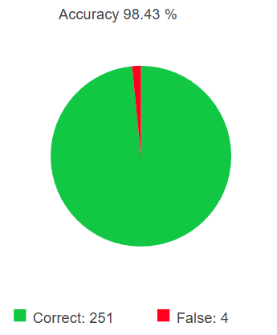
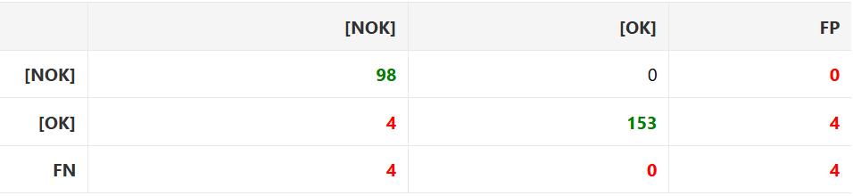
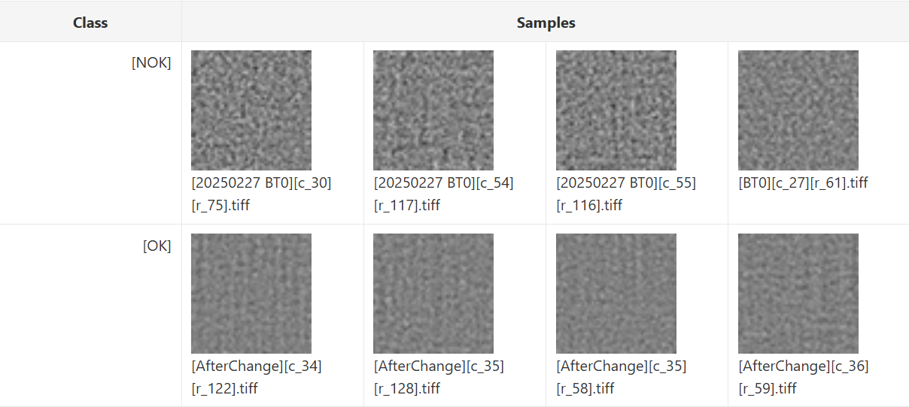
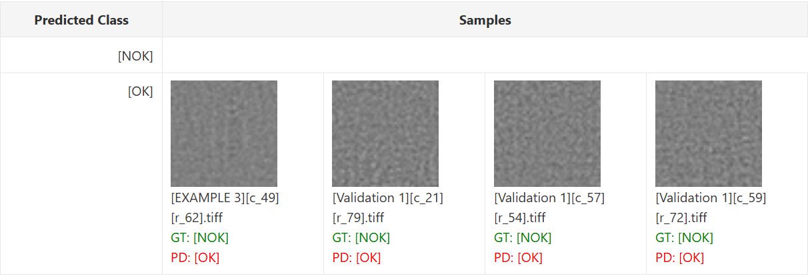
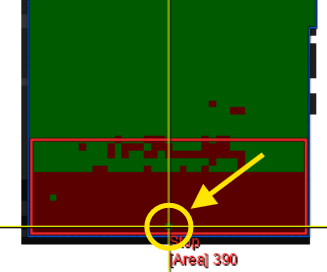
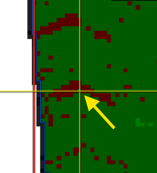

# Deep Learning Rugosity Detection

## 1. Background

This document tries to explain the process of the implementation of a Deep Learning AI model in order to detect rugosity at a material. 

Previously, this system was based on KNN (K-Nearest Neighbors) but it presented certain issues:

- BT0 zones not properly detected
- Shiny Spots not detected as well
- The presence of some dirty areas resulted in some BT0 zones not being correctly detected.
- In processes that require lubricant to make the tread not stick to the press, this lubricant could be added to the tread producing rugosity noise.

To improve the detection, we are going to add deep learning models to classify rugosity in NOK (BT0) and OK (BT1, BT2, … BT6).

## 2. Deep Learning Tool Process

We used Deep Learning Tool 25.04 to create the model.

### 2.1. Preparing the dataset

To start, we have to create an image dataset, classifying them with two labels; “NOK” (Non-rough) and “OK” (rough). In this case, we have 678 “NOK” images and 1021 “OK” images. 
Now we have to introduce these images to the tool, with the labels [NOK] and [OK].

In this model, the images in this dataset were sourced from:
- **[OK] images:**
  - AfterChange
  - BeforeEnd
  - Example 3

- **[NOK] images:**
  - 20250227 BT0
  - BT0
  - Example 3
  - Example 6 - Fish
  - twotlines
  - Validation 1
  - Validation 2

### 2.2. Split

To create this model, it is necessary to split the images in three categories; Train, Validation and Test. The split must be similar to a 70/15/15 division. We are doing the split with that proportions.

This results on:
- 1189 images to train
- 255 images to validate
- 255 images to test

The training split is used to make the model visualize the images, learn the patterns on those images, knowing the true label (OK/NOK) and doing this several times to consolidate that knowledge.

The validation split is used to make a kind of a test while doing the training. To see what parameters the deep learning model must change, to learn more and have better results on that validation.

The test split has the goal of evaluating the final results of the training and validation. This is the important part, because it shows clearly if it is a good model or not. To consider a good model, depending on the size of the test split (here it is a good amount of images, 255), normally to have more than a 95% of test accuracy.

### 2.3. Training 

Now the model must do the training, and this is such an important part about the configuration of the deep learning model. Some of the parameters we had implemented are:
- **Pretrained Model**: MVTec provides pretrained neural networks, which are good starting points to fine-tune on the custom data. Which model to use depends on the available time, memory, complexity of the problem, and required accuracy. Here we used “Compact”.
- **Image width/height**: Width and height of the input images the network will process. Minimize the time for training and inference by making the values as small as possible while all features can still be recognized well. Sizes differing from the size used to train the network may show a reduced classification accuracy, though. Here we have 51x51 pixel images.
- **Number of epochs**: Number of full iterations over the entire training data, we have done 20 epochs.
- **Number of iterations**: Number of times a single batch is passed through the network, interdependent with Number of Epochs, we have done 760 iterations.

There are more customizable parameters, but not needed at the moment.

### 2.4. Evaluation 

After the training is done, the evaluation goes next. When it finishes, it must show how many of the test split images (255), are well classified by the model, and how many are wrongly classified. 

The tool also shows a **confusion matrix**, explained below:
This confusion matrix lets you compare the numbers of predicted classes of an evaluated training with the correct classes.
- **Columns**: Ground truth, number of correspondingly labeled images.
- **Rows**: Predicted results per class.
- **Main Diagonal**: Correctly predicted images per class.
- **FP (Column)**: Number of images that have been predicted to belong to this class but actually belong to another class.
- **FN (Row)**: Number of images for which the network failed to detect that the images belong to this class.

The confusion matrix is a really useful method to quickly visualize the results of the model, seeing the mistakes. 

The tool also shows the wrongly classified images, making it possible to see if they have something in common or if they are just isolated errors. For example, if the 4 images are non-rough but really close to a rough zone, it may have some zones detected as rough, this is an understandable error for the model. Ultimately, if it only detects four errors in isolated areas across the whole image, those errors are practically negligible.

## 3. Evaluation Report

We are going to analyze the results of the final model.

### Main Features

To start, we are going to describe the main features of the model:

- **Total number of images**: 1699 (51x51 px)
- **Split**: 
  - **Train**: 69.98% (1189 images)
  - **Validation**: 15.01% (255 images)
  - **Test**: 15.01% (255 images)
- **Training**:
  - **Pretrained Model**: Enhanced
  - **Width x Height**: 51 x 51
  - **Number of Channels**: 3
  - **Number of Epochs**: 20
  - **Number of Iterations**: 760
  - **Batch Size**: 32
  - **Weight Prior**: 0

### Evaluation Results

After setting this features and completing the training, the model needs to do an evaluation, these are the results:

As we can see, the final test got a 98.43% accuracy, meaning that it got 251 images right labeled, while it also had 4 wrong labeled.

This is considered a good result, only 4 wrongly classified images in a total of 255, is not such a thing.

The confusion matrix provided by the tool helps to make a better analysis of the model, as it is explained below: 

The columns shows the ground truth of the image labels, while the rows shows the predicted labels for the images in the test.

As we can see, the fails are positioned at the [NOK] column (ground truth), [OK] row (predicted). In other words; the 4 wrongly classified images are truly [NOK] images that the model classified as [OK] images.

We can also see the model had classified 98 [NOK] images and 153 [OK] images correctly (diagonal, green numbers).

The total amount of wrongly classified images is 4 (bottom right, red number), and the total amount of images processed is 255 (the overall sum).

The tool also provide some examples of correct prediction de model has done:

Here, it shows 4 correctly classified [NOK] images and 4 [OK] images as well. It also shows us the image name.

We can also see the False Positives of the test:

A False Positive, relative to the [OK] class, occurs when an image truly being a [NOK] is labeled by the model as a [OK]. In the other way, a [OK] classified as a [NOK] is called False Negative. Also, when a [OK] is classified correctly, it is called True Positive, but when a [NOK] is classified correctly, it is called True Negative.

It is important to set a class as a reference, because it is not the same to talk about a false positive of [A] class and a false positive of [B] class.

To sum up, relative to [A] class:
- **True Positive**: [A] image classified as [A]. Correct✅
- **True Negative**: [B] image classified as [B]. Correct✅
- **False Positive**: [B] image classified as [A]. Incorrect❌
- **False Negative**: [A] image classified as [B]. Incorrect❌

Returning to our the main topic, we can see the 4 false positives, which we will now analyze:

- [EXAMPLE 3] [c_49] [r_62]

We can see that there are no BT1 (OK/green) zones nearby, so this must be an isolated error. This type of isolated errors should not be a major concern, as long as they do not occur in large quantities.

- [Validation 1] [c_21] [r_79]

Unlike the previous case, here there are variations on the rugosity, resulting on OK an NOK zones nearby.

Let´s analyze manually the image:

As it is a 51x51 image, it is blur when we make it bigger. But we can see it is a mostly bright image, with not so much contrast of bright and dark, so we can understand the model made a slight error here.

- [Validation 1] [c_57] [r_54]

In fact, this image over here is located right in a roughness transition zone, making the error understandable.

- [Validation 1] [c_59] [r_72]

Same thing, located in a roughness transition zone, not such a big error.

## 4. Conclusion

The implementation of the Deep Learning model for rugosity detection has proven to be highly successful, showing a significant improvement over the previous KNN-based system. With an overall test accuracy of 98.43%, the model successfully learned to differentiate between non-rough [NOK] and rough [OK] surfaces, overcoming the previous issues related to shiny spots, dirty areas, and lubricant noise.

The evaluation of the confusion matrix reveals that the model is extremely robust. Out of 255 test images, only 4 were misclassified. Notably, all 4 errors were False Positives (true [NOK] images classified as [OK]), with zero False Negatives recorded.

Furthermore, the manual analysis of these misclassifications shows that the model's behavior is logical and predictable. Three out of the four errors occurred in physical transition zones, where rough and non-rough areas meet. In 51x51 pixel patches, these boundaries naturally contain a mix of textures, making the classification mathematically ambiguous. The single isolated error is negligible.

In conclusion, the minor and completely understandable nature of these deviations confirms that the model is highly reliable. It successfully solves the main pain points of the previous inspection system and is considerably viable for production deployment, after the significant results obtained in the tests performed.