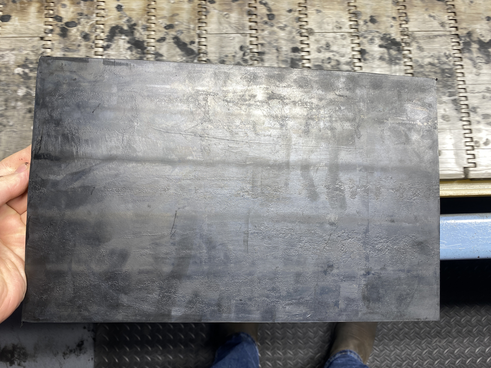
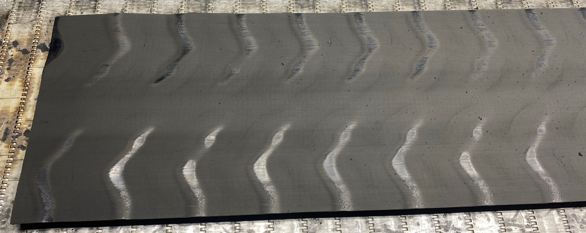
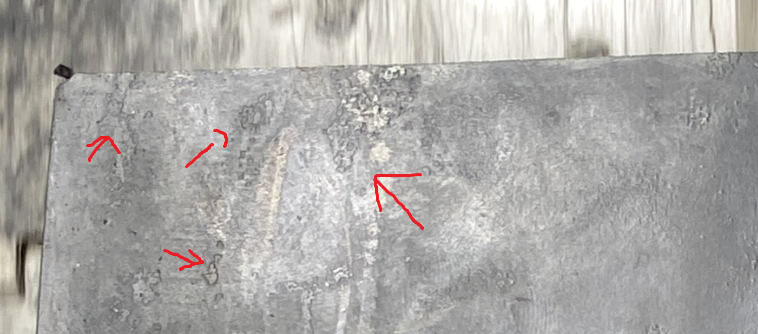
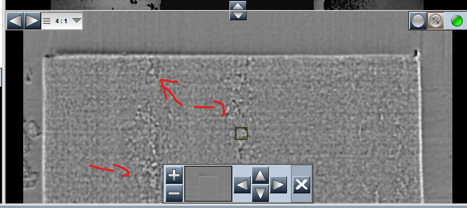
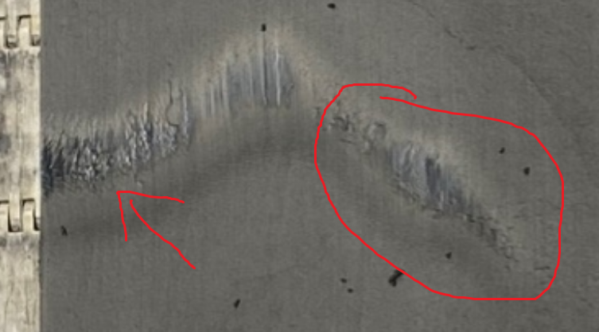
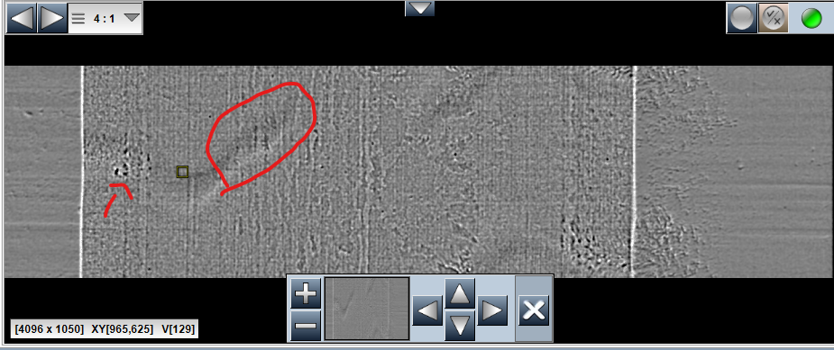
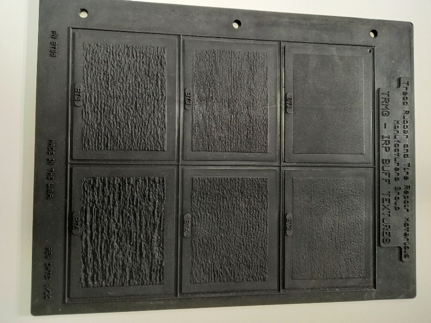

``` metadata-DocumentOptions
[HeaderPath]=.\header.html
```

# No Buffered Rugosity

This document try to explain the next issue: "It is possible to filter rugosity produced during curing process that rugosity produced by buffering process."

We think that with current process is not possible. More info in Conclusion.

## Background

### Images

Two images with BT0 zones was taken by system and the BT0 zones were not detected.

First image is a no buffered tread while second image is a tread with shiny spots.

After improve machine learning model, somo point of first image could be deleted but shiny spots in the second image is not detected.


    


### Tread Process

We are not sure about this part. This is that we think that process tread is.

Before buffered process, a curing process is done in a press. To prevent the press and the tread from sticking, lubricant is used in the press.

This lubricant could be added to the tread producing rugosity noise.

## Rugosity Produced Before Buffering

### No Buffered Example.

In this examples, dirty areas appear. It produce that all BT0 zones are not detected. Dirty zones are considered as rugosity zones.





### Shiny Spot Example

In this examples, dirty zones appear inside shiny spots.





## Could Dirty Rugosity Be Filtered?

We can assume that rugosity produced in buffering process has a vertical direction, while rugosity produced during curing process is irregular.

With that background, We have tried to get only the vertical component of rugosity but we have two main issue:

+ Patter rugosity is not vertical direction.



+ Vertical component in dirty rugosity could be higher that BT1 rugosity.

Therefore, we consider that it is not possible to filter out the dirty rugosity.

## Conclusion

We think that current vision system consist in Photometry Image - Coocurrence Matrix - Machine Learning don't allow detect difference between Dirty Rugosity and Buffered Rugosity. 

We wonder if it is possible to limit the rugosity produced during curing process. This could significantly improve the vision system.

Our team think that use Deep Learning could help to filter Dirty Rugosity, but some issue will appear:

+ System take a big amount of heavy images and Deep Learning need more computing power. An analysis of the necessary hardware must be done.
+ The current system performs well only with 10-piece training. A Deep Learning system may need a significantly larger number of pieces.
+ An Analysis of Deep Learning process must be done before implement on machine. 

